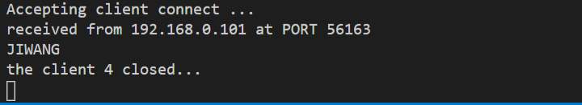
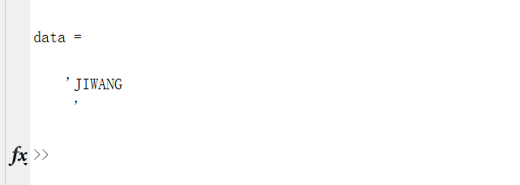

# cpp_matlab_tcp

C++，matlab使用TCP进行通信

## 服务端

Cpp程序作为服务端，采用主线程 + 工作线程，主线程负责接收新的连接，并开辟新的线程，

```C
connfd = Accept(listenfd, (struct sockaddr *)&cliaddr, &cliaddr_len); 
ts[i].cliaddr = cliaddr;
ts[i].connfd = connfd;
pthread_create(&tid, NULL, do_work, (void*)&ts[i]);
pthread_detach(tid);                                  
```

工作线程负责处理每个连接的读写，收到客户端的数据，大写转小写

```
n = Read(ts->connfd, buf, MAXLINE);                     //读客户端
if (n == 0) {
	printf("the client %d closed...\n", ts->connfd);
	break;                                              //跳出循环,关闭cfd
}
printf("received from %s at PORT %d\n",
inet_ntop(AF_INET, &(*ts).cliaddr.sin_addr, str, sizeof(str)),
ntohs((*ts).cliaddr.sin_port));                 //打印客户端信息(IP/PORT)

for (i = 0; i < n; i++) 
	buf[i] = toupper(buf[i]);                           //小写-->大写

Write(STDOUT_FILENO, buf, n);                           //写出至屏幕
Write(ts->connfd, buf, n);                              //回写给客户端
```




## 客户端

客户端给服务器发送一个消息，收到返回一个大写

```matlab
clc;clear;close all;

% 创建一个socket
t_client=tcpip('192.168.0.116',8000,'NetworkRole','client');

% 尝试连接服务器，相当于connect，发起三次握手
fopen(t_client);

txt_send = 'jiwang';
pause(1);
% 写
fprintf(t_client,txt_send);
pause(1);
% 读
data = fscanf(t_client)

fclose(t_client);

```

